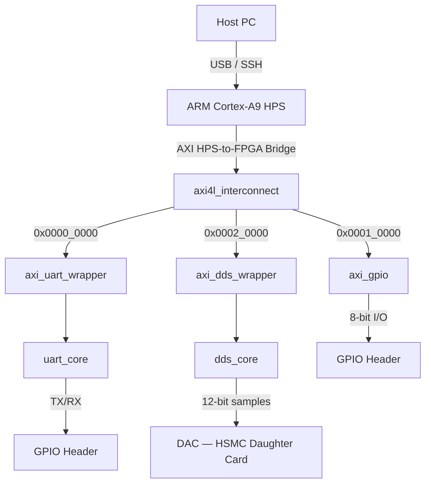

# AXI4-Lite Peripheral Subsystem

Synthesisable AXI4-Lite peripheral subsystem targeting an Intel/Altera Cyclone V SoC (ARM Cortex A9 HPS). Implements UART, GPIO, and DDS peripherals behind a 1-to-N address decoding interconnect. Full UVM verification environment will be applied to the design, including constrained-random stimulus, further mutation testing, and formal SVA closure; modelling a pre-silicon, block-level design to verification workflow.

## Architecture
The HPS-Bridge-to-FPGA is utilised as integrated in the HPS directly with the FPGA via AXI protocol. Software programs 
can be written such that the HPS accesses the custom peripherals placed within the FPGA, through memory-mapped registers -- essentially the same mechanism uses in many standard peripherals. No external buses or discrete controllers are considered in the design.

**Interconnect**: decodes `addr[17:16]` and routes the AXI transaction to one of three peripherals. Unmapped address should return a `SLVERR` without stalling the bus. Write and read paths are independent state machines, allowing R/W overlap per the AXI4-Lite specification.

**Peripheral Structure**: follows a 2-layer pattern. The AXI wrapper handles protocol mechanics (handshake FSM, register file, back-pressure, error response), and each peripheral core is bus-agnostic to which it can communicate at a byte-level handshake, therefore it is portable to any bus interface. GPIO logic is the exception, being intentionally left without a wrapper -- no separation needed. 

**Verification**: mirrors a pre-silicon block-level flow. Each peripheral is verified standalone initially by direction simulation, to a UVM environment before integration. A mutation testing framework injects RTL faults and measures this as a _test-bench kill rate_. Surviving faults are closed with SVA properties proven formally, with _SymbiYosys_. The result is a quantified verification closure report rather than a simple coverage number in isolation. 

## System Flow

- **Host PC** — terminal, Python script, or SCPI bench automation
- **HPS** (`sw/demo/main.c`, `sw/drivers/`) — bare-metal C running on ARM Cortex-A9; writes to memory-mapped peripheral registers via the Cyclone V HPS-to-FPGA AXI bridge (configured in Platform Designer)
- **AXI Bridge** — built-in Cyclone V hardware; no RTL required; maps HPS memory space into FPGA fabric
- **Interconnect** (`rtl/axi4l_interconnect.sv`) — decodes `addr[17:16]`, routes to one of three AXI4-Lite slaves; returns `SLVERR` on unmapped addresses
  - `0x0000_0000` → UART
  - `0x0001_0000` → GPIO
  - `0x0002_0000` → DDS
- **UART** (`rtl/axi_uart_wrapper.sv` + `rtl/uart_core.sv`) — 16550-style register map; 8-entry TX/RX FIFOs; 16x oversampling RX; configurable baud rate; serial TX/RX on GPIO header pins
- **GPIO** (`rtl/axi_gpio.sv`) — 8-bit bidirectional port; direction register; interrupt-on-change with W1C clear; routed to GPIO header pins
- **DDS** (`rtl/axi_dds_wrapper.sv` + `rtl/dds_core.sv`) — 32-bit phase accumulator; 1024-entry sine LUT; 12-bit output to DAC on HSMC daughter card
- **Bench measurement** (`scripts/bench/dds_characterise.py`) — Python over SCPI to lab oscilloscope; measures DDS output frequency and SFDR; compares against simulation-predicted values

## Quick Links 

| Document                                                  | Description                                    |
| --------------------------------------------------        | ---------------------------------------------- |
| [System Architecture](docs/architecture.md)               | Top-level block diagram, address map, clocking |
| [Module Arch. Spec.](docs/mas/modules.md)                 | Component architecture, RAL, notes             |
| [Verification Plan](docs/verification/plan.md)            | Methodology, coverage targets, tool flow       |
| [TB Results](docs/verification/results.md)                | Directed TC results, waveforms                 |
| [Mutation Report](docs/verification/mutation_report.md)   | Kill rate, surviving mutants, SVA closures     |

## Target hardware 
 _Terasic_ DE10-Nano -- Intel Cyclone V SE SoC (5CSEBA6), dual-core ARM Cortex-A9 HPS. UART, GPIO, and DDS peripherals accessible from HPS via the AXI4-Lite HPS-to-FPGA bridge in Platform Designer (Quartus).
