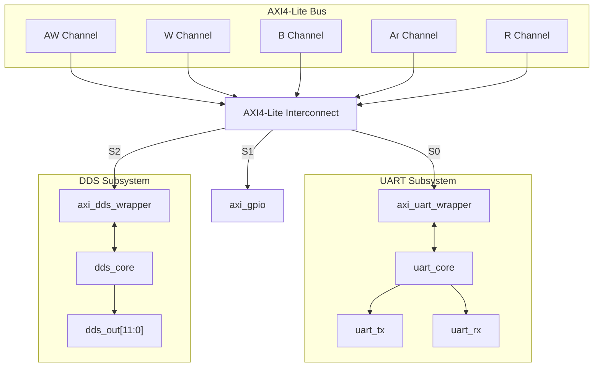
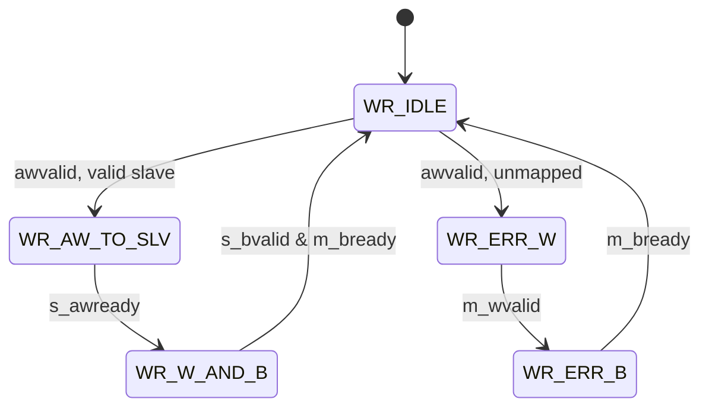
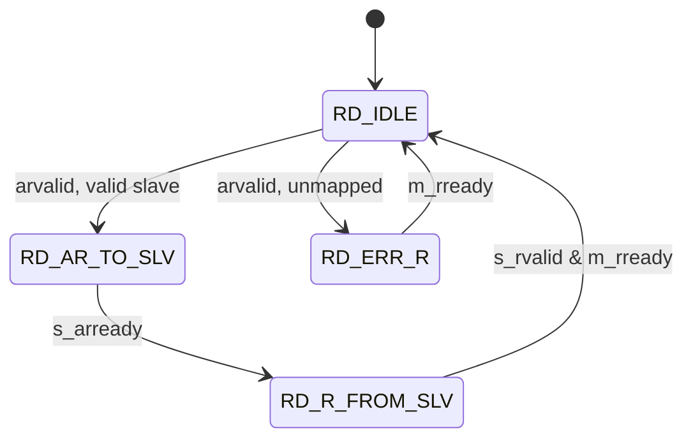
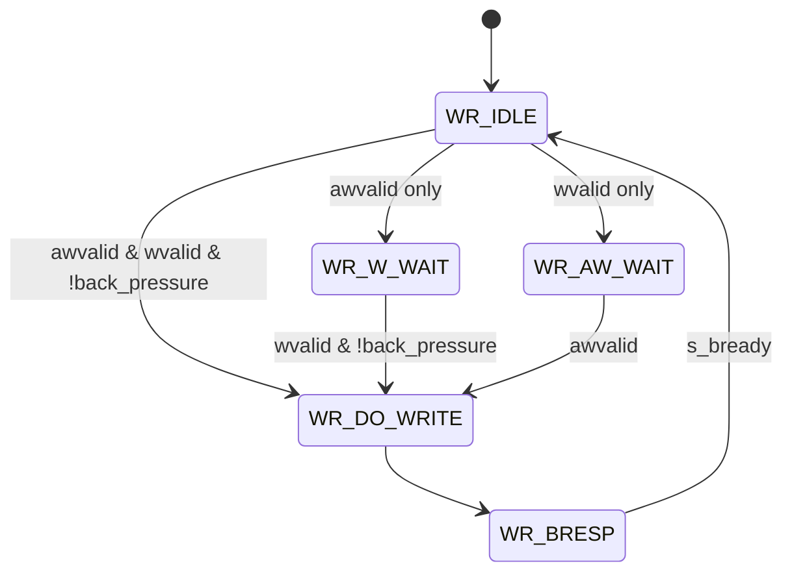
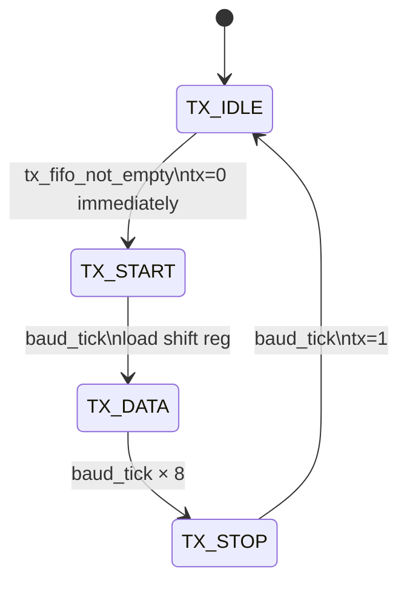
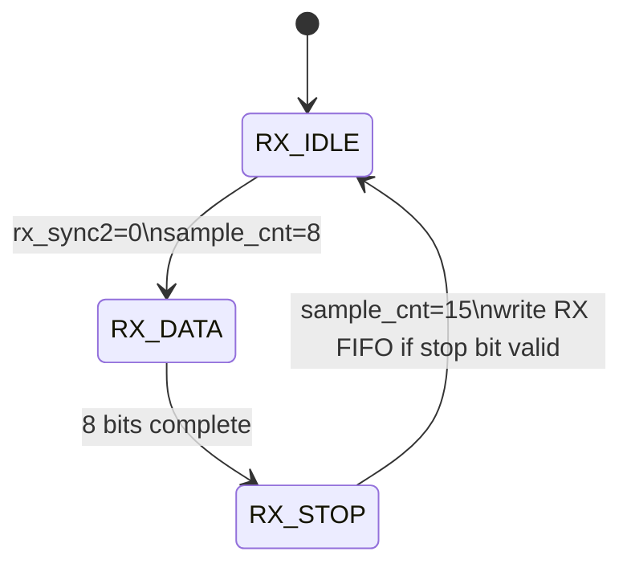

# Module Architecture Specifications

> RTL source: `rtl/` | Generated from design as of Stage 1

## Table of Contents

- [`axi_periph_top`](#axi_periph_top)
	- [`axi4_lite_interconnect`](#axi4_lite_interconnect)
	- [`axi_uart_wrapper`](#axi_uart_wrapper)
		- [`uart_core`](#uart_core)
	- [`sync_fifo`](#sync_fifo)
	- [`axi_gpio`](#axi_gpio)
	- [`axi_dds_wrapper`](#axi_dds_wrapper)
		- [`dds_core`](#dds_core)

---

## `axi_periph_top`

**File:** `rtl/axi_periph_top.sv`  
**Instantiated in:** Top level -- Quartus project / TB top  
**Parameters:** `ADDR_W=32`, `DATA_W=32`

**Purpose:**  
Top-level wrapper for the peripheral subsystem. Instantiates the
interconnect, all peripheral wrappers and cores, and exposes a single
flat AXI4-Lite slave port and physical I/O signals. Flat ports used
throughout for Verilator and Quartus compatibility.

### Port list

| Port | Dir | Width | Description |
|---|---|---|---|
| `clk` | in | 1 | System clock |
| `rst_n` | in | 1 | Active-low async reset |
| `s_awaddr` | in | 32 | AXI write address |
| `s_awprot` | in | 3 | Write protection |
| `s_awvalid` | in | 1 | Write address valid |
| `s_awready` | out | 1 | Write address ready |
| `s_wdata` | in | 32 | Write data |
| `s_wstrb` | in | 4 | Write byte strobes |
| `s_wvalid` | in | 1 | Write data valid |
| `s_wready` | out | 1 | Write data ready |
| `s_bresp` | out | 2 | Write response |
| `s_bvalid` | out | 1 | Write response valid |
| `s_bready` | in | 1 | Write response ready |
| `s_araddr` | in | 32 | AXI read address |
| `s_arprot` | in | 3 | Read protection |
| `s_arvalid` | in | 1 | Read address valid |
| `s_arready` | out | 1 | Read address ready |
| `s_rdata` | out | 32 | Read data |
| `s_rresp` | out | 2 | Read response |
| `s_rvalid` | out | 1 | Read data valid |
| `s_rready` | in | 1 | Read data ready |
| `uart_tx` | out | 1 | UART serial transmit |
| `uart_rx` | in | 1 | UART serial receive |
| `gpio_out` | out | 8 | GPIO output port |
| `gpio_in` | in | 8 | GPIO input port |
| `gpio_irq` | out | 1 | GPIO interrupt |
| `dds_out` | out | 12 | DDS sine output to DAC |
| `dds_valid` | out | 1 | DDS output valid strobe |

### Internal architecture

### Notes 
- GPIO and DDS slave ports on interconnect tied off (`awready=0`) until Stage 3 instantiation 
- `gpio_in` tied off to suppress Verilator UNUSEDSIGNAL until Stage 3 

---

## `axi4_lite_interconnect` 
**File:** `rtl/axi4_lite_interconnect.sv` 
**Instantiated in:** `axi_periph_top` 
**Parameters:** `ADDR_W=32`, `DATA_W=32` 

**Purpose:** 1-to-3 AXI4-Lite address-decoding interconnect. Routes master transactions to one of three slaves by address. Independent write and read state machines allow R/W overlap. Returns `SLVERR` on unmapped addresses without stalling the bus.

### Port list

| Port    | Dir | Width | Description                   |
| ------- | --- | ----- | ----------------------------- |
| `clk`   | in  | 1     | System clock                  |
| `rst_n` | in  | 1     | Active-low reset              |
| `m_aw*` | in  | —     | Master write address channel  |
| `m_w*`  | in  | —     | Master write data channel     |
| `m_b*`  | out | —     | Master write response channel |
| `m_ar*` | in  | —     | Master read address channel   |
| `m_r*`  | out | —     | Master read data channel      |
| `s0_*`  | —   | —     | Slave 0 — UART                |
| `s1_*`  | —   | —     | Slave 1 — GPIO                |
| `s2_*`  | —   | —     | Slave 2 — DDS                 |
|         |     |       |                               |

### Address map

| Slave | Base          | Decode              | Status |
| ----- | ------------- | ------------------- | ------ |
| UART  | `0x0000_0000` | `addr[17:16]=2'b00` | Active |
| GPIO  | `0x0001_0000` | `addr[17:16]=2'b01` | #TODO  |
| DDS   | `0x0002_0000` | `addr[17:16]=2'b10` | #TODO  |
| ERROR | all others    | `addr[17:16]=2'b11` | SLVERR |

### Write FSM



### Read FSM



### Notes
- Write and read FSMs are fully independent — overlap is legal
- AW accepted immediately in WR_IDLE (`m_awready=1`; combinational)
- `addr` and `prot` buffered before forwarding to slave

---

## `axi_uart_wrapper`

**File:** `rtl/axi_uart_wrapper.sv`  
**Instantiated in:** `axi_periph_top`  
**Parameters:** `ADDR_W=32`, `DATA_W=32`, `BAUD_DIV_W=16`

**Purpose:**  
AXI4-Lite slave wrapper for `uart_core`. Implements the register file,
write/read handshake FSMs, back-pressure on THR when TX FIFO is full,
SLVERR on writes to read-only registers, and IRQ generation.

### Port list

| Port | Dir | Width | Description |
|---|---|---|---|
| `clk` | in | 1 | System clock |
| `rst_n` | in | 1 | Active-low reset |
| `s_aw*` | in | — | AXI write address channel |
| `s_w*` | in | — | AXI write data channel |
| `s_b*` | out | — | AXI write response channel |
| `s_ar*` | in | — | AXI read address channel |
| `s_r*` | out | — | AXI read data channel |
| `wr_en` | out | 1 | Push byte to TX FIFO |
| `wr_data` | out | 8 | TX byte |
| `rd_en` | out | 1 | Pop byte from RX FIFO |
| `rd_data` | in | 8 | RX byte |
| `baud_div` | out | 16 | Baud rate divisor to core |
| `tx_full` | in | 1 | TX FIFO full |
| `tx_empty` | in | 1 | TX FIFO empty |
| `rx_full` | in | 1 | RX FIFO full |
| `rx_empty` | in | 1 | RX FIFO empty |
| `rx_valid` | in | 1 | RX byte available |
| `irq` | out | 1 | Interrupt output |

### Register map

> Auto-generated from `scripts/reggen/regs.yaml`
> See [register_map.md](register_map.md)

| Offset | Name | Access | Reset | Description |
|---|---|---|---|---|
| `0x00` | THR | WO | `0x00` | TX data — write byte to TX FIFO |
| `0x00` | RBR | RO | `0x00` | RX data — read byte from RX FIFO |
| `0x04` | IER | RW | `0x00` | Interrupt enable |
| `0x08` | LSR | RO | `0x60` | Line status |
| `0x0C` | LCR | RW | `0x00` | Line control (stub) |
| `0x10` | BAUD_DIV | RW | `0x0000` | Baud rate divisor |

### IER bit map

| Bit | Field | Description |
|---|---|---|
| [1] | TXIE | TX empty interrupt enable |
| [0] | RXIE | RX ready interrupt enable |

### LSR bit map

| Bit | Field | Description |
|---|---|---|
| [6] | TEMT | TX completely empty |
| [5] | THRE | TX holding register empty |
| [4] | BI | Break interrupt (stub) |
| [3] | FE | Framing error (stub) |
| [2] | PE | Parity error (stub) |
| [1] | OE | Overrun error — RX FIFO full |
| [0] | RXDR | RX data ready |

### Write FSM



### SLVERR conditions
- Write to `LSR` (read-only)
- Write to unmapped offset

### Back-pressure
`WREADY` held low when `tx_full && addr==THR`. No data dropped.

### IRQ logic
```systemverilog
irq = (IER[0] & rx_valid) | (IER[1] & tx_empty)
```

---

## `uart_core`

**File:** `rtl/uart_core.sv`  
**Instantiated in:** `axi_periph_top`  
**Parameters:** `BAUD_DIV_W=16`

**Purpose:**  
Bus-agnostic UART transmitter/receiver. Accepts byte-level handshake
from `axi_uart_wrapper`. No AXI awareness -- replaceable with any bus
wrapper targeting the same handshake interface.

### Port list

| Port | Dir | Width | Description |
|---|---|---|---|
| `clk` | in | 1 | System clock |
| `rst_n` | in | 1 | Active-low reset |
| `wr_en` | in | 1 | Push byte into TX FIFO |
| `wr_data` | in | 8 | TX byte |
| `rd_en` | in | 1 | Pop byte from RX FIFO |
| `rd_data` | out | 8 | RX byte |
| `baud_div` | in | 16 | Baud clock divisor |
| `tx_full` | out | 1 | TX FIFO full |
| `tx_empty` | out | 1 | TX FIFO empty |
| `rx_full` | out | 1 | RX FIFO full |
| `rx_empty` | out | 1 | RX FIFO empty |
| `rx_valid` | out | 1 | RX byte available |
| `tx` | out | 1 | UART TX serial line |
| `rx` | in | 1 | UART RX serial line |

### Baud rate formula
$$T_{\text{baud\_tick\_16x}} = (\text{baud\_div} + 1) \times T_{\text{clk}}$$ $$\text{Baud Rate} = \frac{f_{\text{clk}}}{(\text{baud\_div} + 1) \times 16}$$ **Example Calculation:** For a system configuration where $f_{\text{clk}} = 50\text{ MHz}$ and $\text{baud\_div} = 26$: $$\text{Baud Rate} = \frac{50,000,000}{(26 + 1) \times 16} \approx 115,740\text{ baud}$$
### TX FSM



### RX FSM



### Notes
- 2-FF synchroniser on RX input -- prevents metastability
- RX samples at `sample_cnt==8` of 0-15; bit centre maximises noise margin
- Frame error detected in RX_STOP but not yet flagged in LSR[3] -- see [#issue](../../issues/)

---

## `sync_fifo`

**File:** `rtl/sync_fifo.sv`  
**Instantiated in:** `uart_core` (×2 — TX and RX)  
**Parameters:** `WIDTH=8`, `DEPTH=8`

**Purpose:**  
Synchronous FIFO with parameterised width and depth. Ring-buffer
implementation using extra-MSB pointer scheme to distinguish full from
empty without a separate flag register. Combinational read output —
infers LUT RAM, suitable for small FIFOs.

### Port list

| Port | Dir | Width | Description |
|---|---|---|---|
| `clk` | in | 1 | System clock |
| `rst_n` | in | 1 | Active-low reset |
| `wr_en` | in | 1 | Write enable |
| `wr_data` | in | WIDTH | Write data |
| `full` | out | 1 | FIFO full |
| `rd_en` | in | 1 | Read enable |
| `rd_data` | out | WIDTH | Read data (combinational) |
| `empty` | out | 1 | FIFO empty |
| `count` | out | log2(DEPTH)+1 | Occupancy count |

### Pointer scheme

Extra MSB on `wr_ptr` and `rd_ptr` distinguishes full from empty
when base addresses match:
- empty: `wr_ptr == rd_ptr`  (all bits including MSB)
- full: `count == DEPTH`
- count: `wr_ptr - rd_ptr`   (modulo arithmetic, correct across wraparound)

### Notes
- No overflow/underflow protection -- caller checks `full`/`empty`
- Combinational read -- data valid same cycle as `rd_ptr` update
- Infers distributed LUT RAM -- appropriate for depth ≤ 64

---

### TBC - GPIO, DDS, etc. 
